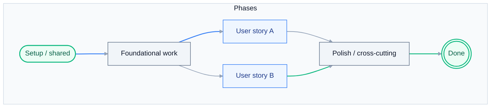

# Tasks: {{TITLE}}

> **Grounding:** {{GROUNDING_CITATIONS}}
> **Input**: `./spec.md`, `./plan.md`

**Format**: `[ID] [P?] [Story] Description` - include exact file paths in descriptions.

## Architecture diagram

Execution order vs. parallel tracks (replace with story IDs and real tasks).

## Phase 1: Setup (Shared Infrastructure)

- [ ] T001 [P] [US1] {{T001}}
- [ ] T001A [US1] Run the compatibility preflight from [docs/ORCHESTRATOR_DEPLOYMENT.md](../../docs/ORCHESTRATOR_DEPLOYMENT.md) before scaffolding, package selection, pack, publish, or deploy; record Studio/CLI/package/target-folder evidence.
- [ ] T001B [US1] Confirm paradigm `{{PARADIGM}}` and CLI family `{{CLI_FAMILY}}`; if unknown, stop and resolve project type before implementation.

---

## Phase 2: Foundational (Blocking Prerequisites)

**Purpose**: Core infrastructure that MUST be complete before user stories.

- [ ] T002 [US1] {{T002}}
- [ ] T002A [US1] Record feasibility grounding links for this story using `uipath_library_lookup`, `uipath_skill_match`, and `query_uipath_docs` when library evidence is insufficient.

**Checkpoint**: Foundation ready.

---

## Phase 3: User Story 1 - {{US1_TITLE}} (Priority: P1)

**Goal**: {{US1_GOAL}}

**Independent Test**: {{US1_IND_TEST}}

### Tests for User Story 1

- [ ] T010 [P] [US1] {{T010_TEST}}

### Implementation for User Story 1

- [ ] T011 [US1] {{T011_IMPL}}

### Paradigm-specific tasks

{{PARADIGM_TASK_BLOCKS}}

**Checkpoint**: User Story 1 independently functional.

---

## Phase 4: Polish & Cross-Cutting

- [ ] T020 [P] {{T020}}
- [ ] T021 [P] Optional deploy handoff: if deployment is in scope, request explicit approval and follow [docs/ORCHESTRATOR_DEPLOYMENT.md](../../docs/ORCHESTRATOR_DEPLOYMENT.md); do not embed unsafe deploy commands in this task list.

---

## Phase 5: Build, Verify, and Handoff

**Purpose**: Convert the accepted plan into a verified build artifact.

- [ ] T030 Run the accepted-plan handoff: confirm `spec.md`, `plan.md`, and
  `tasks.md` are reviewed and accepted before source edits.
- [ ] T030A {{PLANNER_TASKS}}
- [ ] T031 Execute implementation tasks in order, using the specialist skill(s)
  cited in `plan.md` for project-specific source changes.
- [ ] T032 Run the build loop for the detected project type: restore -> analyze
  -> test -> pack. Stop on analyzer errors or failing tests.
- [ ] T033 Summarize exact verification evidence, changed files, package path
  if produced, and any approval-required deploy follow-up.
- [ ] T034 Verify deploy gate: `{{DEPLOY_GATE}}`

---

## Dependencies & Execution Order

{{DEPENDENCIES_TEXT}}
