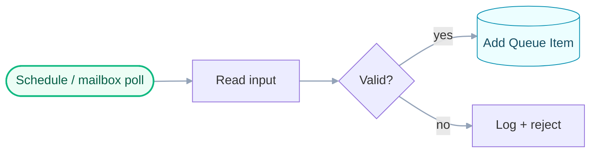
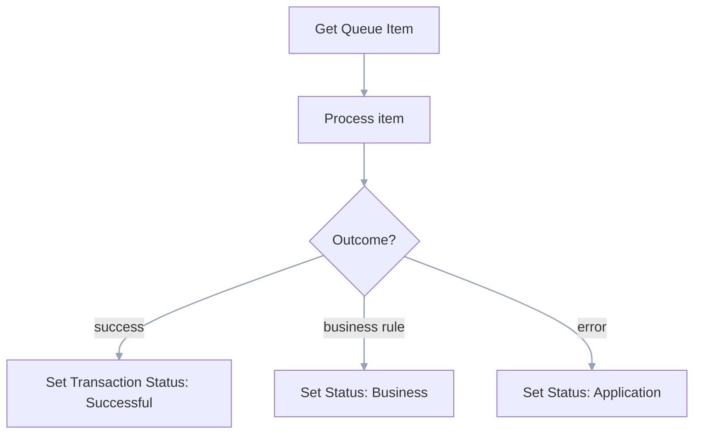
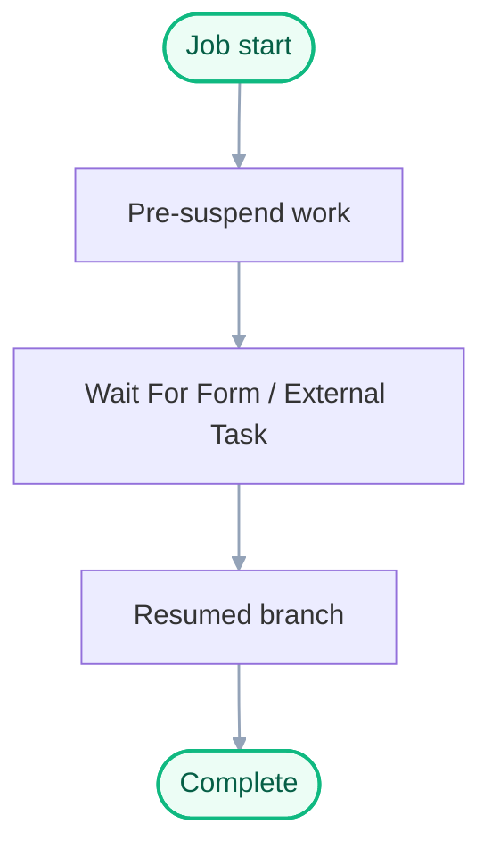
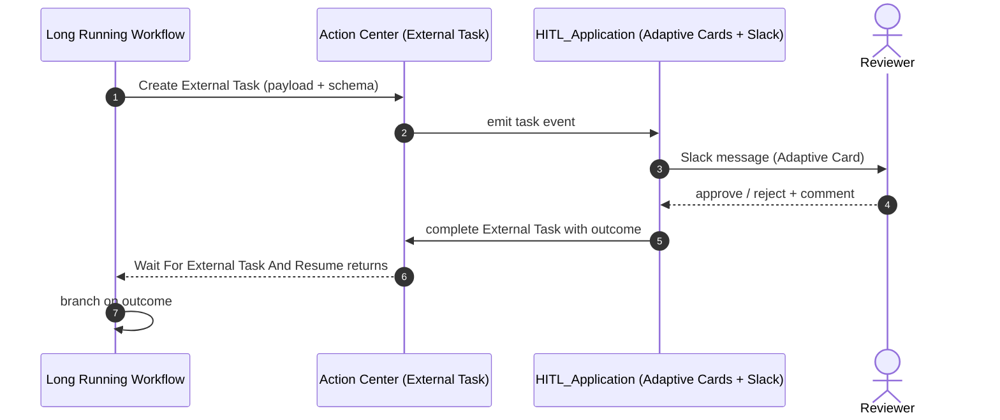
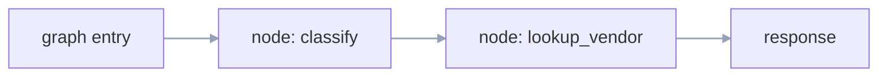
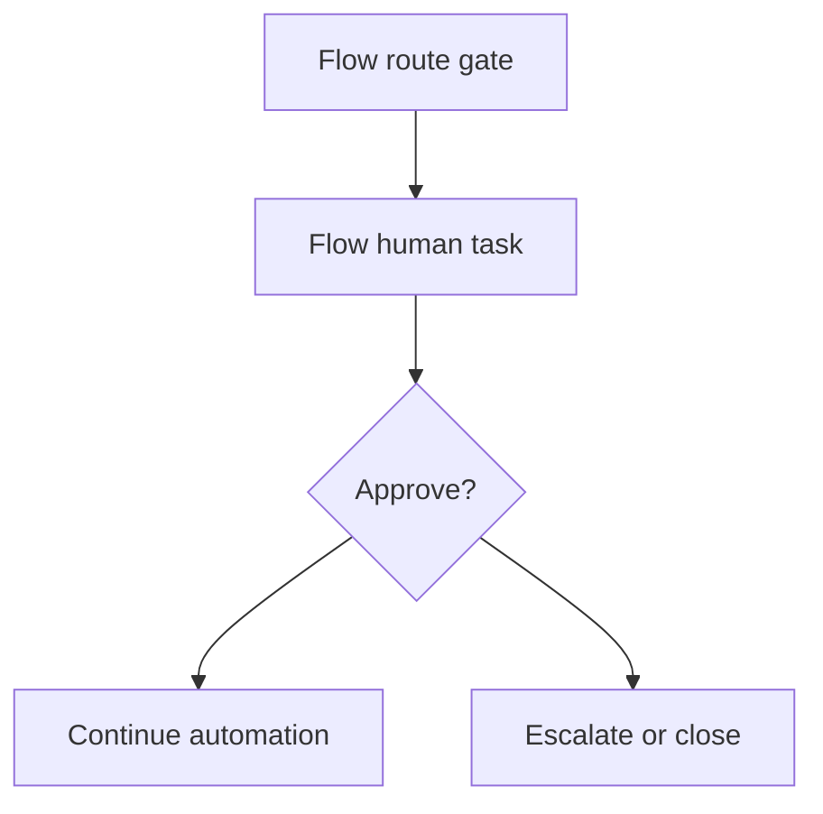
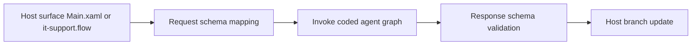
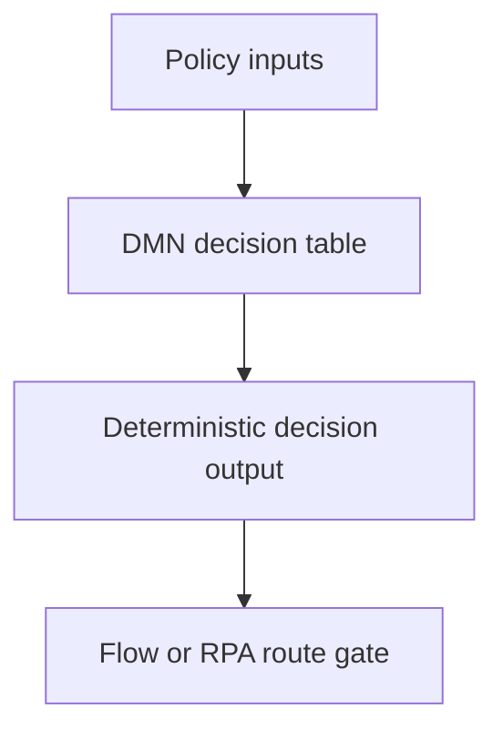
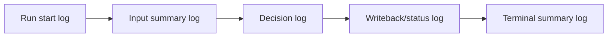

# UiPlan Workflow Catalog

Curated reference of workflow templates available to the Solution Engineer when
filling `plan.md` `## Workflow Catalog` and `tasks.md` per-workflow tasks.

Each entry includes:

- **Diagram** (Pro Standard Mermaid using `classDef` / `linkStyle`).
- **When to use** / **When not to use**.
- **Required activities / nodes** (resolve names via `uipath_doc_get_activity`).
- **CLI verbs** for build/verify.
- **Skills, subagents, and MCP tools** to route through.
- **Verification evidence** expected in `tasks.md`.

---

## Dispatcher (RPA, Sequence)

Polling intake that enqueues work items.

- **When to use**: scheduled or event-triggered intake; producer side of a
  Dispatcher/Performer split.
- **When not to use**: long-running per-item processing; use Performer or LRW.
- **Required activities**: `UiPath.Mail.Activities.GetIMAPMailMessages` (or
  connector-specific intake), `UiPath.Core.Activities.AddQueueItem`,
  `UiPath.Core.Activities.LogMessage` (correlationId).
- **CLI**: `uipcli package restore | analyze | pack`.
- **Skills**: `[skill:uipath-rpa]`, `[skill:uipath-platform]`. **MCP**:
  `uipath_doc_get_activity`, `uipath_library_search`.

---

## Performer / Queue Worker (RPA, Flowchart)

Per-item processor.

- **When to use**: deterministic per-item processing.
- **When not to use**: human waits crossing job boundaries (use LRW).
- **Required activities**: `GetTransactionItem`, `SetTransactionStatus`.
- **Skills**: `[skill:uipath-rpa]`. **MCP**: `uipath_doc_get_activity`.

---

## Long Running Workflow (RPA, persisted)

Orchestrator-persisted workflow that suspends across human or external events.

- **When to use**: process truly waits for human or external system.
- **When not to use**: synchronous deterministic work — use Sequence/Flowchart.
- **Required activities**: `WaitForForm`, `WaitForExternalTaskAndResume`,
  `CreateExternalTask`.
- **Skills**: `[skill:uipath-rpa]`, `[skill:uipath-custom-hitl]`.

---

## Custom HITL (Action Center External Tasks + Slack Adaptive Cards)

The org-standard HITL: External Tasks combined with the
[`cato-networks-IT/HITL_Application`](https://github.com/cato-networks-IT/HITL_Application)
(Adaptive Cards + Slack approval).

- **When to use**: any human approval / data-enrichment / write-back gate where
  the org wants Slack-based UX with audit trail.
- **When not to use**: Action Center forms only (use plain LRW + WaitForForm).
- **Flow-owned HITL override**: if accepted spec/plan explicitly assigns HITL to
  Flow, use the `Flow-owned HITL` pattern below and document the override in
  `plan.md` routing.
- **Required activities**: `CreateExternalTask`, `WaitForExternalTaskAndResume`,
  HITL_Application webhook config (Slack channel, card schema, callback URL).
- **CLI**: `uipcli package analyze | pack`; HITL_Application deployed
  separately.
- **Skills**: `[skill:uipath-custom-hitl]`, `[skill:uipath-rpa]`.
- **MCP**: `uipath_doc_get_activity` (External Task activities),
  `uipath_library_search` (`Action Center External Tasks`).
- **Verification evidence**: external-task creation log + resume outcome log +
  audit correlation id.

---

## LangGraph Coded Agent

Stateful agent with named graph + nodes.

- **When to use**: stateful reasoning, branching, tool-calling.
- **When not to use**: pure document retrieval (use LlamaIndex).
- **Required artifacts**: `langgraph.json`, `main.py:graph`, request/response
  schema. **Model**: UiPath LLM Gateway via `uipath_langchain.chat.UiPathChat`.
- **CLI**: `uipath run`, `uv run pytest`, `uipath pack | publish`.
- **Skills**: `[skill:uipath-agents]`.

---

## LlamaIndex Coded Agent

Document-heavy retrieval / index-backed agent.

- **When to use**: retrieval over a corpus.
- **When not to use**: stateful tool-calling — use LangGraph.
- **Required artifacts**: `llama_index.json`, indexer + query entrypoint.

---

## Maestro / BPMN Flow

Studio Web BPMN flow (`.bpmn` / `.flow`).

- **When to use**: cross-system process orchestration with explicit BPMN events.
- **When not to use**: simple worker loops — use Sequence/Flowchart.
- **Skills**: `[skill:uipath-maestro-flow]`.
- **Verification evidence**: flow validate output + runtime debug/smoke trace.

---

## Coded App / Coded Action App

TypeScript-backed app surfaces.

- **Required artifacts**: `app.config.json`, `action-schema.json`, `src/`.
- **CLI**: `uip codedapp build | test | deploy`.
- **Skills**: `[skill:uipath-coded-apps]`.

---

## API Workflow

`api-workflow.json` for synchronous API-style workflows.

- **CLI**: `uipcli package` verbs.
- **Skills**: `[skill:uipath-rpa]`.

---

## Email Intake (connector)

UiPath.Mail.Activities or Integration Service Email connector.

- **When to use**: mailbox polling for Dispatcher.
- **Required activities**: `GetIMAPMailMessages` /
  `UiPath.Email.Activities.Office365.GetMailMessages`.
- **Verification evidence**: connector auth check + intake sample evidence with
  non-stub message identifiers.

---

## Queues / Buckets / Data Fabric

Platform-level data planes.

- **Queues**: `AddQueueItem`, `GetTransactionItem`, `SetTransactionStatus`.
- **Buckets**: `UiPath.Storage.Activities` for blob I/O.
- **Data Fabric**: `uip df` for entity/record CRUD;
  `[skill:uipath-data-fabric]`.

---

## Flow-owned HITL

Use Flow itself as the HITL canvas when the accepted spec explicitly requires
it (override of custom HITL default).

- **When to use**: plan/spec explicitly requires HITL inside Flow.
- **When not to use**: standard org custom HITL via Action Center + Slack app.
- **Required artifacts**: `.flow` task node schema, assignee mapping, timeout/escalation.
- **CLI**: `uip flow validate` and flow runtime smoke where safe.
- **Skills**: `[skill:uipath-maestro-flow]`, `[skill:uipath-human-in-the-loop]`.
- **Verification evidence**: validation log + approve/reject path evidence.

---

## Agent Invocation Boundary (hosted by RPA or Flow)

Explicit boundary between host workflow and coded agent runtime.

- **When to use**: RPA/Flow invokes LangGraph/LlamaIndex for semantic decisions.
- **When not to use**: deterministic-only branches that do not require LLM reasoning.
- **Required artifacts**: host invocation step, `langgraph.json` or `llama_index.json`,
  request/response schema mapping in plan/tasks.
- **CLI**: host verify command + `uipath run` or pytest for agent surface.
- **Skills**: `[skill:uipath-rpa]`, `[skill:uipath-maestro-flow]`, `[skill:uipath-agents]`.
- **Verification evidence**: host logs + agent run output + mapped schema assertions.

---

## DMN Policy Decision Boundary

Deterministic decision layer separating policy from semantic reasoning.

- **When to use**: approval/escalation/compliance routing that must be deterministic.
- **When not to use**: fuzzy classification better handled by agent.
- **Required artifacts**: `.dmn` file + policy IO schema + host invocation row.
- **CLI**: DMN test command (`pytest` or equivalent policy test harness).
- **Skills**: `[skill:dmn-business-rules]`, `[skill:uipath-maestro-flow]`.
- **Verification evidence**: DMN test report + host branch evidence for each decision path.

---

## Studio-visible Logging Contract

Cross-surface logging pattern that must be visible in Studio/job logs.

- **When to use**: all executable workflow surfaces (`.xaml`, `.flow`, hosted agent boundaries).
- **Required logs**: start, input summary (non-PII), decision branch, status transition,
  exceptions, terminal summary.
- **Correlation**: propagate one correlation id across invoked surfaces.
- **Verification evidence**: log assertions for correlation id + expected phase markers.
